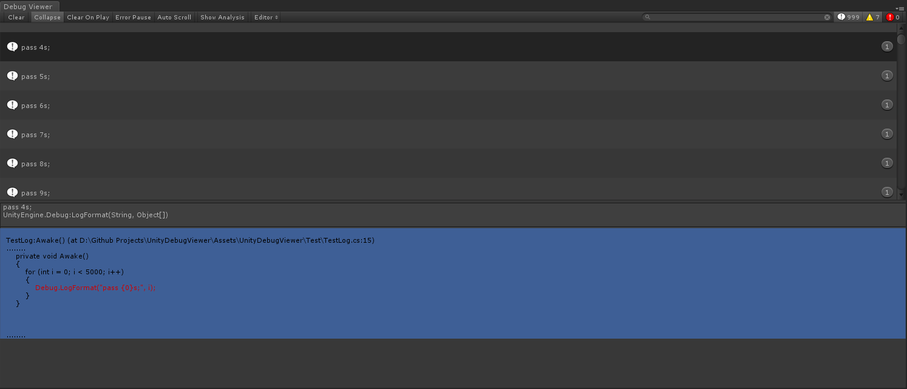
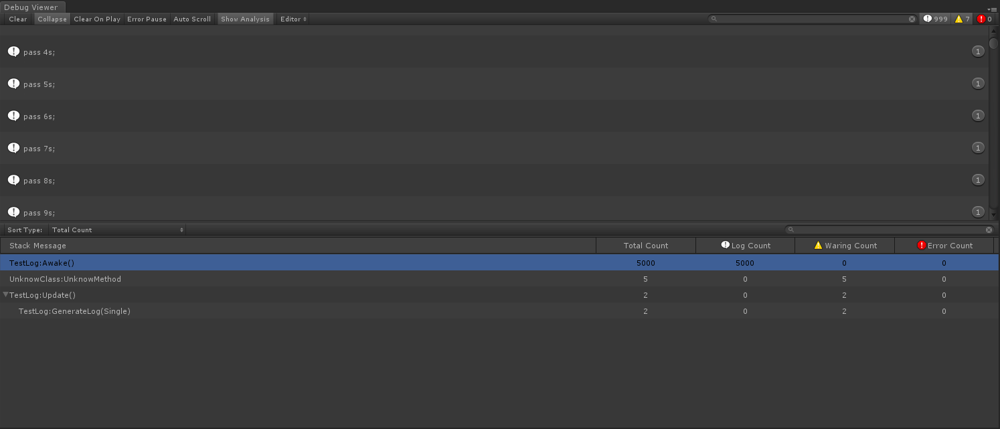

UnityDebugViewer
========================

`UnityDebugViewer`一个功能齐备的Unity Log查看工具，它提供了Unity自带的`Console Window`的所有功能，并在此基础上加入了`搜索`、`查看堆栈源码`和`Log统计`等功能。
通过使用`UnityDebugViewer`，无需安装`Android Studio`或者下载`SDK`就可以很方便地查看Unity在手机上输出的Log。此外，`UnityDebugViewer`还提供了解析Unity保存在手机上的Log文件的功能，帮助开发者使用`UnityDebugViewer`快速分析、定义游戏在手机上运行时遇到的问题。

如何使用
---------------------

1. 将本仓库克隆至本地或者直接下载
1. 将`Assets/UnityDebugViewer`文件夹移植至项目中`Assets`目录下的任意文件夹
1. 选择`Window->Debug Viewer`打开窗口

基本功能
---------------------

1. 清理log（Clear）、折叠log（Collapse）、运行时清理log（Clear On Player）、遇到error时暂停（Error Pause）和过滤log类型等`Console Window`具备的功能；
1. `自动滚动至最新log`的功能：勾选`Auto Scroll`，当有新的log输出至窗口时，滚动条会自动滚动至底部；
1. `搜素log`的功能：在工具栏右边的搜索框，输入`关键词`或者`正则表达式`可以对当前的log进行搜索；
1. `显示堆栈源代码内容`的功能：选中某一条log，可以展示该log的所有堆栈信息。如果堆栈包含源代码信息，且对应的文件存在，可以直接展示源码的内容；

1. `跳转到源代码`的功能：如果log的堆栈包含源代码信息，直接用鼠标右键双击log或者堆栈，可以直接打开对应的源代码文件，并直接跳转对应的行数；
1. `复制粘贴`的功能：在log或者堆栈上点击`鼠标右键->Copy`，可以复制log的内容或者堆栈的完整信息；
1. `统计Log`的功能：勾选`Show Analysis`，窗口下方会展示出当前所有log的统计信息。可以通过切换`Sort Type`来改变当前用于筛选log的类型，也可以在右边的搜索框输入`关键词`或者`正则表达式`进行搜索；

1. `使用键盘改变当前选中对象`的功能：当选中log、堆栈或者log统计条目的时候，可以按`↑`和`↓`来改变当前选中的对象。此外，选中log时，还可以按鼠标中键快速跳转到当前选中的log。