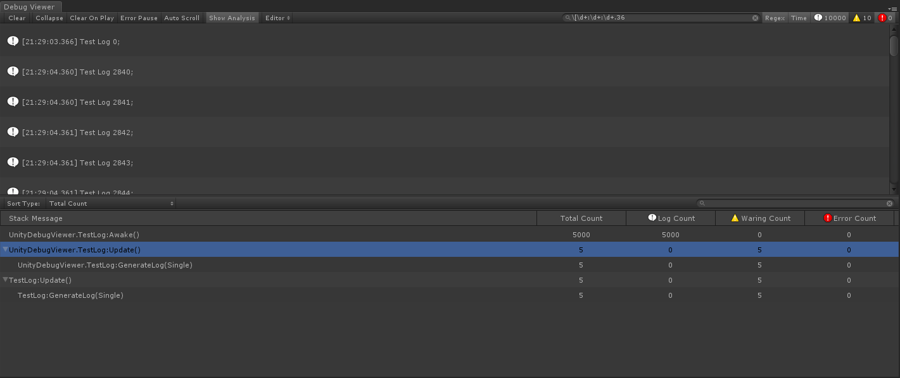
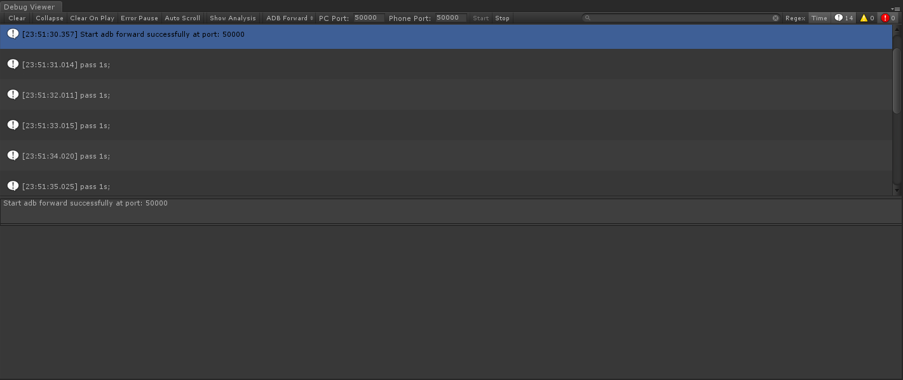
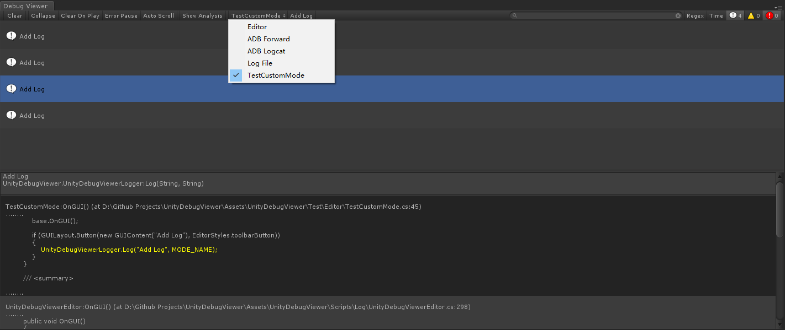

- [UnityDebugViewer](#unitydebugviewer)
  * [支持版本](#支持版本)
  * [如何使用](#如何使用)
  * [基本功能](#基本功能)
  * [默认模式](#默认模式)
    + [Editor](#editor)
    + [ADB Forward](#adb-forward)
    + [ADB Forward](#adb-forward-1)
    + [Log File](#log-file)
  * [添加自定义的模式](#添加自定义的模式)

UnityDebugViewer
========================

`UnityDebugViewer`一个功能齐备的Unity Log查看工具，它提供了Unity自带的`Console Window`的所有功能，并在此基础上加入了`搜索`、`查看堆栈源码`和`Log统计`等功能。
通过使用`UnityDebugViewer`，无需安装`Android Studio`或者下载`SDK`就可以很方便地查看Unity在手机上输出的Log。此外，`UnityDebugViewer`还提供了解析Unity保存在手机上的Log文件的功能，帮助开发者使用`UnityDebugViewer`快速分析、定义游戏在手机上运行时遇到的问题。

支持版本
---------------------

`UnityDebugViewer`使用Unity 5.6.6f2开发完成，能支持Unity 4.x以上版本


如何使用
---------------------

1. 将本仓库克隆至本地或者直接下载
1. 将`Assets/UnityDebugViewer`文件夹移植至项目中`Assets`目录下的任意文件夹
1. 选择`Window->Debug Viewer`打开窗口

基本功能
---------------------

1. 清理log（Clear）、折叠log（Collapse）、运行时清理log（Clear On Player）、遇到error时暂停（Error Pause）和过滤log类型等`Console Window`具备的功能；
1. `修改log框大小`的功能：点击`UnityDebugViewer`右上角的下拉菜单，并点击`Log Entry`可以选择log框的大小
1. `自动滚动至最新log`的功能：勾选`Auto Scroll`，当有新的log输出至窗口时，滚动条会自动滚动至底部；
1. `搜素log`的功能：在工具栏右边的搜索框，输入`关键词`或者`正则表达式`可以对当前的log进行搜索；
1. `对时间进行筛选`的功能：勾选搜索框右侧的`Time`之后，会显示log产生的时间，此时可以使用`正则表达式`对时间进行筛选，从而获取某个时间段内产生的所有log；

1. `显示堆栈源代码内容`的功能：选中某一条log，可以展示该log的所有堆栈信息。如果堆栈包含源代码信息，且对应的文件存在，可以直接展示源码的内容；

1. `跳转到源代码`的功能：如果log的堆栈包含源代码信息，直接用鼠标右键双击log或者堆栈，可以直接打开对应的源代码文件，并直接跳转对应的行数；
1. `复制粘贴`的功能：在log或者堆栈上点击`鼠标右键->Copy`，可以复制log的内容或者堆栈的完整信息；
1. `统计Log`的功能：勾选`Show Analysis`，窗口下方会展示出当前所有log的统计信息。可以通过切换`Sort Type`来改变当前用于筛选log的类型，也可以在右边的搜索框输入`关键词`或者`正则表达式`进行搜索；

1. `使用键盘改变当前选中对象`的功能：当选中log、堆栈或者log统计条目的时候，可以按`↑`和`↓`来改变当前选中的对象。此外，选中log时，还可以按鼠标中键快速跳转到当前选中的log；

默认模式
---------------------

`UnityDebugViewer`拥有`Editor`、`ADB Forward`、`ADB Logcat`和`Log File`四种默认模式，它们分别拥有不同的功能。

### Editor
`UnityDebugViewer`的`Editor`模式等同于Unity自带的`Console Window`，它能获取使用`UnityEngine.Debug`输出的log以及项目编译、运行时产生的告警或者异常信息。


### ADB Forward
`UnityDebugViewer`的`ADB Forward`模式集成了adb的forward指令，允许用户通过tcp将项目在手机上运行时产生的log数据传输至`UnityDebugViewer`上。

其使用方式如下：
1. 将`UnityDebugViewer/Test/TestTcp.cs`附加到项目初始场景的某一空物体中
1. 在将项目构建成apk时勾选`Development`，然后将构建好的apk安装至安卓设备并运行
1. 使用usb连接线将安卓设备连接至电脑，并开启`开发者调试`选项
1. 按照实际情况修改`PC Port`(PC端用于数据转发的端口)和`Phone Port`(手机端用于数据转发的端口)
1. 点击`Start`开始收集并输出log，点击`Stop`停止收集log

如果不想使用默认的`TestTcp.cs`脚本，也可以很方便地使用`UnityDebugViewer`提供的工具类实现数据转发的功能。`TestTcp.cs`提供了如何获取、转发log数据的例子，可以参照其注释和代码在项目中自定义一个用于传输log数据的工具。
``` cs
using UnityEngine;

namespace UnityDebugViewer
{
    public class TestTcp : MonoBehaviour
    {
        private UnityDebugViewerTransfer transfer;
        private void Awake()
        {
            /// 创建一个tcp传输实例
            transfer = new UnityDebugViewerTransfer();
            /// 创建一个tcp server socket并侦听50000端口
            transfer.CreateServerSocket(50000);

            /// 开始收集log信息
            Application.logMessageReceivedThreaded += CaptureLogThread;

            DontDestroyOnLoad(this.gameObject);
        }

        private void OnDestroy()
        {
            Application.logMessageReceivedThreaded -= CaptureLogThread;
            transfer.Clear();
        }

        private void CaptureLogThread(string info, string stacktrace, UnityEngine.LogType type)
        {
            if (transfer == null)
            {
                return;
            }
            lock (transfer)
            {
                /// 将收集到的log数据序列化成byte[]
                /// 并转发至连接到指定端口的tcp client socket
                var logData = new TransferLogData(info, stacktrace, type);
                byte[] sendData = UnityDebugViewerTransferUtility.StructToBytes(logData);
                transfer.SendData(sendData);
            }
        }
    }
}
```


### ADB Forward
`UnityDebugViewer`的`ADB Logcat`模式集成了adb的logcat命令，无需安装Android Studio就可以直接看到项目在手机上运行时输出的所有log信息。

其使用方式如下：
1. 在已开启`开发者调试`选项的安卓设备上运行项目
1. 使用usb连接线将安卓设备连接至电脑
1. 修改`Tag Filter`以指定使用logcat命令获取哪些log信息，`Tag Filter`为空表示获取所有log信息
1. 点击`Start`开始从手机上获取log并输出至窗口。点击`Stop`停止获取log


### Log File
`UnityDebugViewer`的`Log File`模式提供了解析log文件的功能。

log文件里的log信息格式如下：
```
[log类型] 时间 log内容
堆栈信息
```
其中，log类型可以是`Log`、`Warning`或者`Error`，不区分大小写。log内容可以输入任何符号，且堆栈信息可以为空，如下所示：
```
[Log] 14:09:47.458|810 batteryLevel -> 0.62
batteryStatus -> Discharging
UnityEngine.Logger:Log(LogType, Object)
```
其使用方式如下：
1. 点击`Browser`选择要解析的log文件
1. 点击`Load`加载指定的log文件并解析其内容


添加自定义的模式
---------------------

除了使用`UnityDebugViewer`提供的四种默认模式，`UnityDebugViewer`还允许开发者根据项目的实际需求添加自定义的模式。添加自定义的模式并不复杂，其步骤如下：
1. 在任一`Editor`文件夹下创建一个继承自`UnityDebugViewer.UnityDebugViewerIntermediaryEditor`的类
1. 使用`[InitializeOnLoadMethod]`标记一个`静态方法`作为初始化入口
1. 在初始化入口中使用`UnityDebugViewerEditorManager.RegisterMode`方法注册自定义模式
    > ```UnityDebugViewerEditorManager.RegisterMode<T>(string mode, int order)```    
    > T: UnityDebugViewerIntermediaryEditor或者其子类
    >> 参数：
    >>
    >> mode: 自定义模式的名称
    >> 
    >> order: 自定义模式的权重，用于决定其在下拉列表中的显示顺序。如果权重相同，则会根据注册的顺序来显示
1. 覆写`UnityDebugViewer.UnityDebugViewerIntermediaryEditor`提供的`Clear`、`OnGUI`和`StartCompiling`方法
1. 根据具体需求，使用`UnityDebugViewerLogger.Log`、`UnityDebugViewerLogger.LogWarning`或者`UnityDebugViewerLogger.LogError`方法将log输出至自定义模式对应的UnityDebugViewerEditor上


为了方便使用者快速掌握如何添加自定义的模式，`UnityDebugViewer`提供了`UnityDebugViewer/Test/Editor/TestCustomMode.cs`作为添加自定义模式的例子。

如果不想保留`TestCustomMode`，将`UnityDebugViewer/Test/Editor/TestCustomMode.cs`这一脚本删除即可。以下是`TestCustomMode.cs`的内容和详细注释，它包括了添加自定义模式的所有步骤。
``` cs
using UnityEngine;
using UnityEditor;

namespace UnityDebugViewer
{
    public class TestCustomMode : UnityDebugViewerIntermediaryEditor
    {
        /// <summary>
        /// 模式的名称
        /// </summary>
        private const string MODE_NAME = "TestCustomMode";

        /// <summary>
        /// 标记初始化的入口
        /// </summary>
        [InitializeOnLoadMethod]
        private static void InitializeTestCustomMode()
        {
            /// 自定义模式的权重，用于决定其在下拉列表中的显示顺序
            int order = 10;

            /// 添加自定义的模式
            UnityDebugViewerEditorManager.RegisterMode<TestCustomMode>(MODE_NAME, order);
        }

        /// <summary>
        /// 在点击Clear按钮时被调用
        /// </summary>
        public override void Clear()
        {
            base.Clear();

            UnityDebugViewerLogger.Log("Clear", MODE_NAME);
        }

        /// <summary>
        /// 在下拉列表中选择当前的模式时被调用
        /// </summary>
        public override void OnGUI()
        {
            base.OnGUI();

            if (GUILayout.Button(new GUIContent("Add Log"), EditorStyles.toolbarButton))
            {
                UnityDebugViewerLogger.Log("Add Log", MODE_NAME);
            }
        }

        /// <summary>
        /// 在脚本开始编译时被调用
        /// </summary>
        public override void StartCompiling()
        {
            base.StartCompiling();

            UnityDebugViewerLogger.Log("StartCompiling", MODE_NAME);
        }
    }
}
```