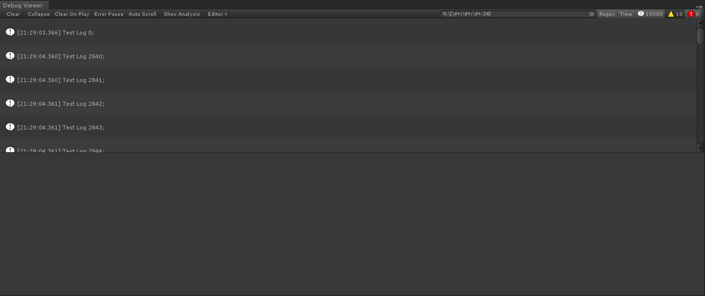
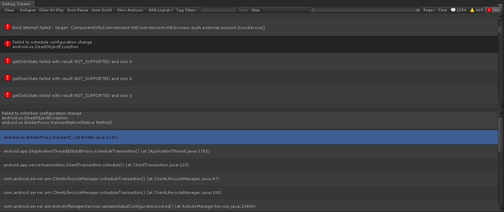

- [UnityDebugViewer](#unitydebugviewer)
  * [支持版本](#支持版本)
  * [如何使用](#如何使用)
  * [基本功能](#基本功能)
  * [拓展功能](#拓展功能)
    + [Editor](#editor)
    + [ADB Forward](#adb-forward)
    + [ADB Logcat](#adb-logcat)
    + [Log File](#log-file)
  * [添加自定义模式](#添加自定义模式)

UnityDebugViewer
========================

`UnityDebugViewer`是一个功能强大的Unity Log查看工具，它集成了`Unity Console Window`的所有功能，并在此基础上加入了`搜索`、`查看堆栈源码`和`Log统计`等功能。
通过使用`UnityDebugViewer`，无需安装`Android Studio`或者下载`SDK`就可以很方便地查看Unity在手机上输出的Log并获取相应的堆栈信息。此外，`UnityDebugViewer`还提供了解析Unity保存在手机上的Log文件的功能，帮助开发者使用`UnityDebugViewer`快速分析、定义游戏在手机上运行时遇到的问题。

支持版本
---------------------

`UnityDebugViewer`使用Unity 5.6.6f2开发完成，能支持Unity 4.x以上版本


如何使用
---------------------
方法一：
 1. 将本仓库克隆至本地
 1. 将`UnityDebugViewer`文件夹移植至项目中`Assets`目录下的任意文件夹
 1. 选择`Window->Debug Viewer`打开窗口

方法二：
 1. 下载最新版本的[Package](https://github.com/AsanCai/UnityDebugViewer/releases)
 1. 将下载好的Package导入至项目中
 1. 选择`Window->Debug Viewer`打开窗口

>注意：如果想要使用`UnityDebugViewer`提供的接口，需要避免将`UnityDebugViewer`存放至名称为`Editor`文件夹之下（包括子文件夹）


基本功能
---------------------

1. 工具栏功能：
    1. 清理log（Clear）、折叠log（Collapse）、运行时清理log（Clear On Player）、遇到error时暂停（Error Pause）和过滤log类型等`Console Window`具备的功能；
    1. 滚动至最新log：勾选`Auto Scroll`按钮，当有新的log输出至窗口时，滚动条会自动滚动至底部；
    1. 统计Log：勾选`Show Analysis`按钮，窗口下方会展示出当前所有log的统计信息（可以通过切换`Sort Type`来改变当前用于筛选log的类型，也可以在右边的搜索框输入`关键词`或者`正则表达式`进行搜索）；
    
    1. 筛选`log`的功能
        1. 启用正则表达式搜索：选中工具栏搜索框右侧的`Regex`按钮，就可以输入正则表达式对log进行筛选；
        1. 显示log的时间：勾选工具栏搜索框右侧的`Time`按钮，将显示产生log的时间，此时可以对时间进行筛选，从而获取某个时间段内产生的所有log；

        
1. 堆栈相关功能：
    1. `显示堆栈源码`的功能：选中某一条log，可以展示该log的所有堆栈信息。如果堆栈包含源代码信息，且对应的文件存在，可以直接展示源码的内容；
    1. `打开堆栈源码`的功能：如果log的堆栈包含源代码信息，直接用鼠标右键双击log或者堆栈，可以直接打开对应的源代码文件，并直接跳转对应的行数；
    
1. 其他功能：
    1. 在log或者堆栈上点击`鼠标右键`并选择`Copy`，可以复制log的内容或者堆栈的完整信息；
    1. 按方向键`↑`和`↓`可以当前选中的对象；
    1. 选中log时，点击`鼠标中键`可以快速跳转到当前选中的log；
    1. `DebugViewer`窗口标签页处点击鼠标右键，可以呼出窗口菜单:
        1. 选择`Log Entry`可以修改log框的大小；
        1. 选择`Save Log`可以将窗口中的log保存至指定文件；
        1. 选择`About UnityDebugViewer`可以打开在线文档；

        


拓展功能
---------------------

`UnityDebugViewer`默认提供了`Editor`、`ADB Forward`、`ADB Logcat`和`Log File`四种模式，它们分别拥有不同的拓展功能。

### Editor
`UnityDebugViewer`的`Editor`模式等同于Unity自带的`Console Window`，它能获取使用`UnityEngine.Debug`输出的log以及项目编译、运行时产生的告警或者异常信息。


### ADB Forward
`UnityDebugViewer`的`ADB Forward`模式集成了adb的forward指令，允许使用者通过Tcp将项目在手机上运行时产生的数据传输至`UnityDebugViewer`上并显示。

>使用方式：
>1. 将`UnityDebugViewer/Test/TestTcp.cs`附加到项目初始场景的某一空物体中
>1. 在将项目构建成apk时勾选`Development`，然后将构建好的apk安装至安卓设备并运行
>1. 使用usb连接线将安卓设备连接至电脑，并开启`开发者调试`选项
>1. 根据需要修改`PC Port`(PC端用于数据转发的端口)和`Phone Port`(手机端用于数据转发的端口)
>1. 点击`Start`开始收集并输出log，点击`Stop`停止收集log


通过使用`UnityDebugViewer`提供的工具类，使用者可以很方便地定义并传输自定义的数据，其基本步骤如下：
1. 定义用于Tcp传输的数据结构
```c#
[Serializable]
[StructLayoutAttribute(LayoutKind.Sequential, Pack=1)]
struct TestStruct
{
    public int c;
    /// 字符串，SizeConst为字符串的最大长度
    [MarshalAs(UnmanagedType.ByValTStr, SizeConst = 256)]
    public string str;
    /// int数组，SizeConst表示数组的个数
    /// 初始化的数组长度必须和SizeConst一致，例test = new int[6];
    [MarshalAs(UnmanagedType.ByValArray, SizeConst = 6)]
    public int[] test;
}
```
1. 在手机端上创建Tcp Server并发送数据
    * 创建一个UnityDebugViewerTransfer实例，并调用CreateServerSocket方法创建一个Tcp Server Socket
    * 使用`UnityDebugViewerTransferUtility.StructToBytes`将数据结构序列化成byte数组
    * 调用UnityDebugViewerTransfer实例的SendData方法向已建立连接的Client发送数据
``` C#
/// 创建一个tcp传输实例
var transfer = new UnityDebugViewerTransfer();
/// 创建一个tcp server socket并侦听50000端口
transfer.CreateServerSocket(50000);

var testData = new TestStruct();
byte[] sendData = UnityDebugViewerTransferUtility.StructToBytes(testData);
transfer.SendData(sendData);
```
1. 检查adb以及设备连接状态，然后使用`adb forward`指令开启`ADB Forward`进程，并建立转发端口
```C#
private void StartADBForward()
{
    if (UnityDebugViewerWindowUtility.CheckADBStatus() == false)
    {
        return;
    }

    string adbPath = UnityDebugViewerWindowUtility.GetAdbPath();
    startForwardProcess = UnityDebugViewerADBUtility.StartForwardProcess(pcPort, phonePort, adbPath);
    /// 成功创建adb forward进程
    if (startForwardProcess)
    {
        ...
    }
}
```
1. 在Editor下创建Tcp Client并接收数据
    1. 创建一个UnityDebugViewerTransfer实例，并绑定receiveDaraFromServerEvent回调事件
    1. 调用UnityDebugViewerTransfer实例的ConnectToServer方法，创建一个Tcp Client并连接到指定的Server
    1. 在receiveDaraFromServerEvent回调事件中处理从服务器收到的数据
    1. 使用UnityDebugViewerTransferUtility.BytesToStruct将byte数组反序列化为数据结构
``` C#
private void ReceiveDataFromServerHandler(byte[] data)
{
    TestStruct logData = UnityDebugViewerTransferUtility.BytesToStruct<TestStruct>(data);
    ...
}

private void StartADBForward()
{
    if (UnityDebugViewerWindowUtility.CheckADBStatus() == false)
    {
        return;
    }

    string adbPath = UnityDebugViewerWindowUtility.GetAdbPath();
    startForwardProcess = UnityDebugViewerADBUtility.StartForwardProcess(pcPort, phonePort, adbPath);
    /// 成功创建adb forward进程
    if (startForwardProcess)
    {
        UnityDebugViewerTransferUtility.receiveDaraFromServerEvent += ReceiveDataFromServerHandler;
        UnityDebugViewerTransferUtility.ConnectToServer("127.0.0.1", port);
    }
}
```
1. 停止ADB Forward进程，并调用UnityDebugViewerTransfer的Clear方法清理Tcp socket和侦听进程
```C#
 private void StopADBForward()
{
    string adbPath = UnityDebugViewerWindowUtility.GetAdbPath();

    UnityDebugViewerADBUtility.StopForwardProcess(adbPath);
    startForwardProcess = false;

    /// will abort process, should excute at last
    UnityDebugViewerTransferUtility.Clear();
}
```

> 说明：
>* UnityDebugViewerTransferUtility是一个在UnityDebugViewerTransfer基础上封装而成的工具类，它管理一个静态UnityDebugViewerTransfer实例，并提供了许多在使用UnityDebugViewerTransfer时会用到的公共接口
>* UnityDebugViewerTransferUtility封装了UnityDebugViewerTransfer的所有公有属性和方法，在大部分情况下，可以直接将UnityDebugViewerTransferUtility当成UnityDebugViewerTransfer实例使用
>* 但如果需要同时使用多个UnityDebugViewerTransfer实例，则需要自己创建UnityDebugViewerTransfer实例并进行管理

`Assets/Test/TestTcp.cs`提供了如何获取、转发log数据的例子，关于如何添加一个自定义模式用于展示自定义数据，详见[添加自定义的模式](#添加自定义模式)。
``` cs
using UnityEngine;

namespace UnityDebugViewer
{
    public class TestTcp : MonoBehaviour
    {
        private UnityDebugViewerTransfer transfer;
        private void Awake()
        {
            /// 创建一个tcp传输实例
            transfer = new UnityDebugViewerTransfer();
            /// 创建一个tcp server socket并侦听50000端口
            transfer.CreateServerSocket(50000);

            /// 开始收集log信息
            Application.logMessageReceivedThreaded += CaptureLogThread;

            DontDestroyOnLoad(this.gameObject);
        }

        private void OnDestroy()
        {
            Application.logMessageReceivedThreaded -= CaptureLogThread;
            transfer.Clear();
        }

        private void CaptureLogThread(string info, string stacktrace, UnityEngine.LogType type)
        {
            if (transfer == null)
            {
                return;
            }
            lock (transfer)
            {
                /// 将收集到的log数据序列化成byte[]
                /// 并转发至连接到指定端口的tcp client socket
                var logData = new TransferLogData(info, stacktrace, type);
                byte[] sendData = UnityDebugViewerTransferUtility.StructToBytes(logData);
                transfer.SendData(sendData);
            }
        }
    }
}
```


### ADB Logcat
`UnityDebugViewer`的`ADB Logcat`模式集成了adb的logcat命令，无需安装Android Studio或者配置SDK环境，只需要使用usb线将手机连接至电脑，就可以直接看到项目在手机上运行时输出的所有log以及产生log的堆栈信息。

>使用方式：
>1. 在已开启`开发者调试`选项的安卓设备上运行项目
>1. 使用usb连接线将安卓设备连接至电脑
>1. 修改`Tag Filter`以指定使用logcat命令获取哪些log信息
>    *  `Tag Filter`为`Unity`表示只捕获Unity生成的log
>    *  `Tag Filter`为空表示捕获安卓系统产生的所有log
>1. 点击`Start`开始从手机上捕获log并输出至窗口，点击`Stop`停止捕获log；


### Log File
`UnityDebugViewer`的`Log File`模式提供了解析log文件的功能，其能解析的log格式与UnityDebugViewer将log保存至文件时使用的格式一致，如下所示：
```
[log类型] 时间 log内容
堆栈信息
```
>* log类型可以是`Log`、`Warning`或者`Error`，不区分大小写
>* log内容可以输入任何符号
>* 堆栈信息可以为空


添加自定义模式
---------------------

除了使用`UnityDebugViewer`提供的四种默认模式，`UnityDebugViewer`还允许使用者根据实际的需求添加自定义的模式。添加自定义模式的步骤并不复杂，如下所示：
1. 在任一`Editor`文件夹下创建一个继承自`UnityDebugViewer.UnityDebugViewerIntermediaryEditor`的类
1. 使用`[InitializeOnLoadMethod]`标记一个`静态方法`作为初始化入口
1. 在初始化入口中使用`UnityDebugViewerEditorManager.RegisterMode`方法注册自定义模式
    > ```UnityDebugViewerEditorManager.RegisterMode<T>(string mode, int order)```    
    > T: UnityDebugViewerIntermediaryEditor或者其子类
    >> 参数：
    >>
    >> mode: 自定义模式的名称
    >> 
    >> order: 自定义模式的权重，用于决定其在下拉列表中的显示顺序。如果权重相同，则会根据注册的顺序来显示
1. 覆写`UnityDebugViewer.UnityDebugViewerIntermediaryEditor`提供的方法：
    1. `Clear`：点击工具栏的`Clear`按钮时被调用
    1. `OnGUI`：在绘制工具栏时被调用，可用于在工具栏上绘制自定义的UI
    1. `StartCompiling`：项目开始编译时被调用，可用于清理线程等数据
1. 使用`UnityDebugViewerLogger.Log`、`UnityDebugViewerLogger.LogWarning`或者`UnityDebugViewerLogger.LogError`方法将log输出至自定义模式对应的UnityDebugViewerEditor上

为了方便使用者快速掌握如何添加自定义的模式，`UnityDebugViewer`提供了`UnityDebugViewer/Test/Editor/TestCustomMode.cs`作为添加自定义模式的例子。以下是`TestCustomMode.cs`的内容和详细注释，它包括了添加自定义模式的所有步骤。

``` cs
using UnityEngine;
using UnityEditor;

namespace UnityDebugViewer
{
    public class TestCustomMode : UnityDebugViewerIntermediaryEditor
    {
        /// <summary>
        /// 模式的名称
        /// </summary>
        private const string MODE_NAME = "TestCustomMode";

        /// <summary>
        /// 标记初始化的入口
        /// </summary>
        [InitializeOnLoadMethod]
        private static void InitializeTestCustomMode()
        {
            /// 自定义模式的权重，用于决定其在下拉列表中的显示顺序
            int order = 10;

            /// 添加自定义的模式
            UnityDebugViewerEditorManager.RegisterMode<TestCustomMode>(MODE_NAME, order);
        }

        /// <summary>
        /// 在点击Clear按钮时被调用
        /// </summary>
        public override void Clear()
        {
            base.Clear();

            UnityDebugViewerLogger.Log("Clear", MODE_NAME);
        }

        /// <summary>
        /// 在下拉列表中选择当前的模式时被调用
        /// </summary>
        public override void OnGUI()
        {
            base.OnGUI();

            if (GUILayout.Button(new GUIContent("Add Log"), EditorStyles.toolbarButton))
            {
                UnityDebugViewerLogger.Log("Add Log", MODE_NAME);
            }
        }

        /// <summary>
        /// 在脚本开始编译时被调用
        /// </summary>
        public override void StartCompiling()
        {
            base.StartCompiling();

            UnityDebugViewerLogger.Log("StartCompiling", MODE_NAME);
        }
    }
}
```